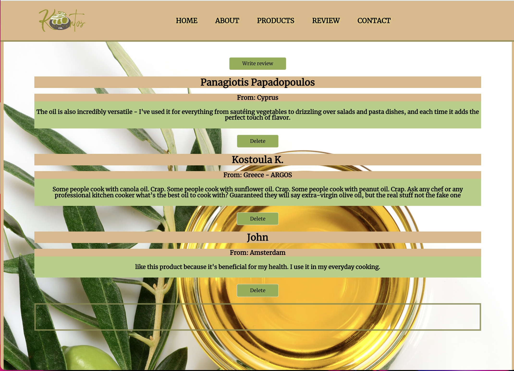
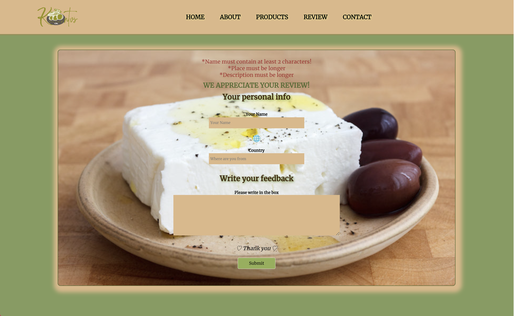
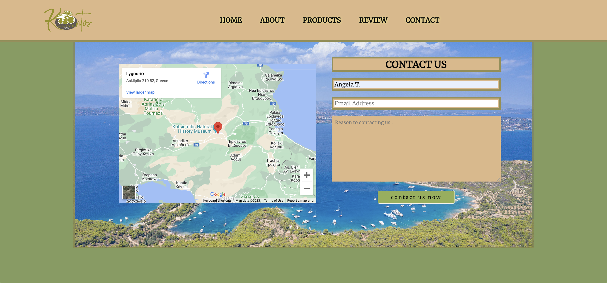
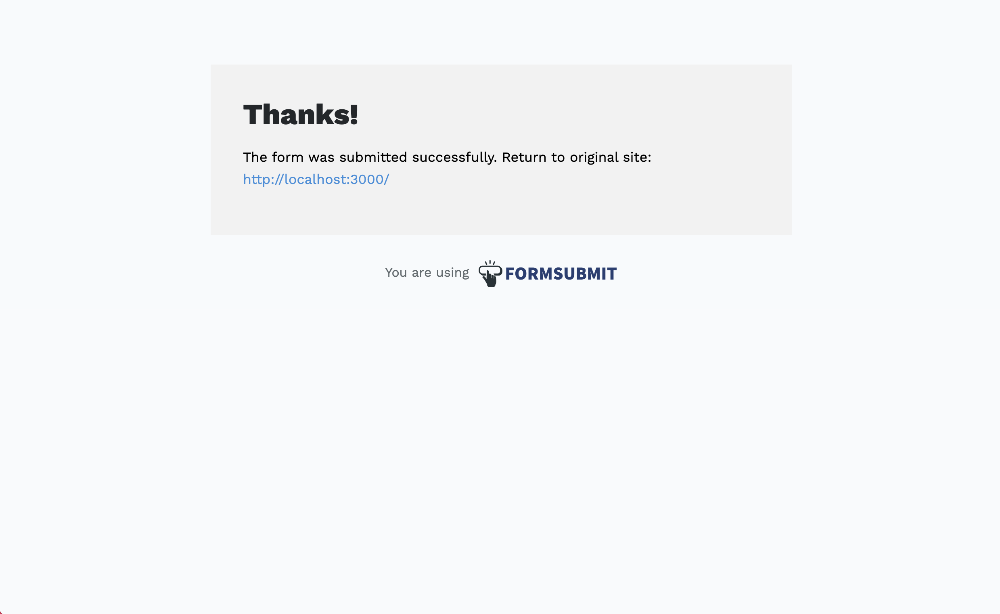
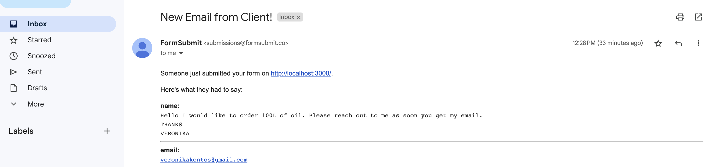
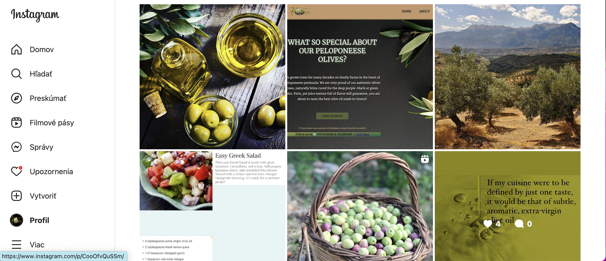

# This project is a Family - Oriented Olive Oil Business web application

#### - The website was an idea, mean to be used for real business purposes for private client from Greece

### Table of Contents!

  - [Table of Contents](#table-of-contents)
  - [General Information](#general-information)
  - [Technologies Used](#technologies-used)
  - [Screenshots](#screenshots)
  - [Setup and Usage](#setup-and-usage)
  - [Project Status](#project-status)
  - [Room for Improvement](#room-for-improvement)
  - [Contact](#contact)
    
## General Information
  This project is a Full-Stack website built using MERN, HTML5, CSS, and Postman.
  The website has its main location in Greece, where users can see Google Maps and check areas where olive trees grow and where olive oil is produced.
  Users can buy online products and contact sellers via email or social media, such as Instagram or Facebook of selling products and more info.
  *(website is responsive for small screens)
  

  ## Technologies Used
- JavaScript
- Mongoose
- Express
- React
- Node.js
- Cors
- Bootstrap
- Axios
- Postman
- Google Map
- Instagram 
- Html5
- CSS

 

## Screenshots
Main page: You can click on the Social media link or click on Logo and this takes you to Instagram.

A small introduction about the background of the product

Product page show all available products to be able to purchase via contacting sellers. The contact click button will take you to a contact page.

The reviews page is for clients who would like to write a review

The write review page is formed with personal info and full validation

Product page show all available products to purchase by contacting sellers. The contact click button will take you to a contact page.

Social media 

 
 

## Getting Started with Create React App

This project was bootstrapped with [Create React App](https://github.com/facebook/create-react-app) &  used CSS.

## Available Scripts

In the project directory, you can run:

### `npm start`

Runs the app in the development mode.\
Open [http://localhost:3000](http://localhost:3000) to view it in your browser.

The page will reload when you make changes.\
You may also see any lint errors in the console.
## start with " npm install"

Launches the test runner in the interactive watch mode.\
See the section about [running tests](https://facebook.github.io/create-react-app/docs/running-tests) for more information.

### `npm run build`

Builds the app for production to the `build` folder.\
It correctly bundles React in production mode and optimizes the build for the best performance.

The build is minified and the filenames include the hashes.\
Your app is ready to be deployed!

See the section about [deployment](https://facebook.github.io/create-react-app/docs/deployment) for more information.

### `npm run eject`

**Note: this is a one-way operation. Once you `eject`, you can't go back!**

If you aren't satisfied with the build tool and configuration choices, you can `eject` at any time. This command will remove the single-build dependency from your project.

Instead, it will copy all the configuration files and the transitive dependencies (webpack, Babel, ESLint, etc) right into your project so you have full control over them. All of the commands except `eject` will still work, but they will point to the copied scripts so you can tweak them. At this point, you're on your own.

You don't have to ever use `eject`. The curated feature set is suitable for small and middle deployments, and you shouldn't feel obligated to use this feature. However, we understand that this tool wouldn't be useful if you couldn't customize it when you are ready for it.

## Learn More

You can learn more in the [Create React App documentation](https://facebook.github.io/create-react-app/docs/getting-started).

To learn React, check out the [React documentation](https://reactjs.org/).

### Code Splitting

This section has moved here: [https://facebook.github.io/create-react-app/docs/code-splitting](https://facebook.github.io/create-react-app/docs/code-splitting)

### Analyzing the Bundle Size

This section has moved here: [https://facebook.github.io/create-react-app/docs/analyzing-the-bundle-size](https://facebook.github.io/create-react-app/docs/analyzing-the-bundle-size)

### Advanced Configuration

This section has moved here: [https://facebook.github.io/create-react-app/docs/advanced-configuration](https://facebook.github.io/create-react-app/docs/advanced-configuration)
  
### Deployment

This section has moved here: [https://facebook.github.io/create-react-app/docs/deployment](https://facebook.github.io/create-react-app/docs/deployment)

### `npm run build` fails to minify

This section has moved here: [https://facebook.github.io/create-react-app/docs/troubleshooting#npm-run-build-fails-to-minify](https://facebook.github.io/create-react-app/docs/troubleshooting#npm-run-build-fails-to-minify)
